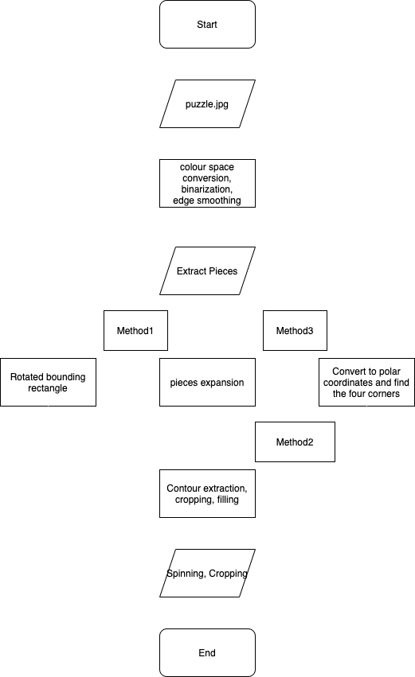
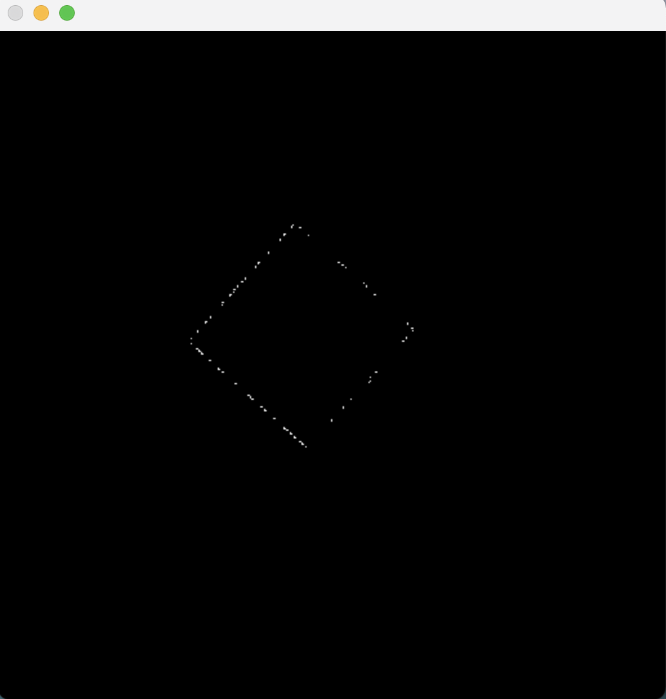
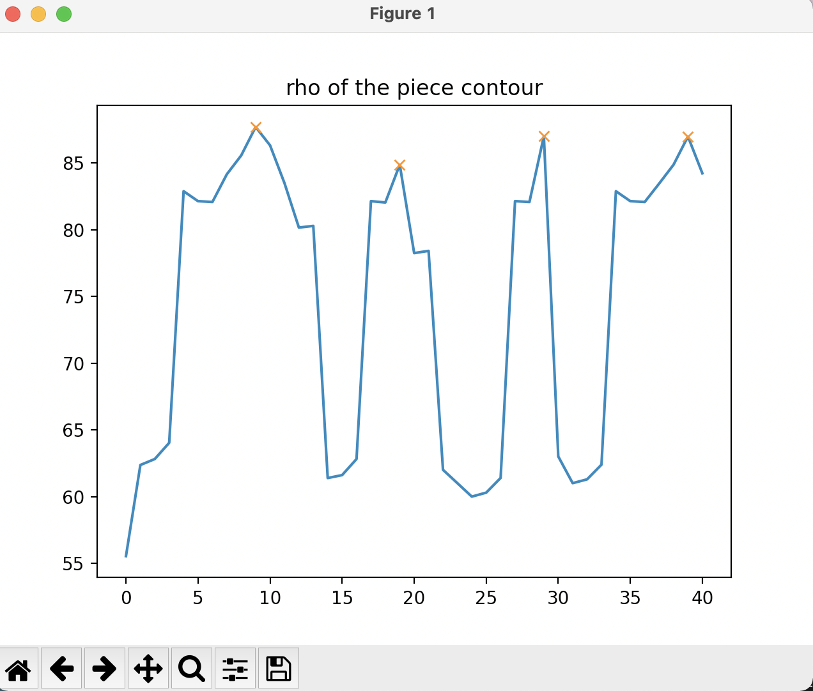

# Jigsaw puzzle detection and alignment with OpenCV

## Abstract
This project is a step of a larger problem: automated solution of the jigsaw puzzle.I extract and orient pieces because this is a necessary step before attempting to solve the puzzle automatically. First we divide a square picture into 16 pieces, each with a few bumps and depressions.Then the pieces are placed on a colored background after being disordered and rotated in orientation. This program is about extracting these pieces, aligning and categorising them.So the "material" show in the documentation are computer generated, and are not the real photos of a puzzle. This is done to simplify the testing process, but ultimately the goal is to do the same with real photos.
The key points of this project are color space transformation, contour extraction and redrawing, finding the convex hull, checking convexity, image rotation, expansion and cropping. The codes are written in python 3.8.2 and run on a Macos 11.2.3. 
<div align=center></div>     
<div align=center></div>


## Requirements:
### Required languages:
* python 3.8.5 or later
### Required packages:
* opencv2
* numpy
* matplotlib

## Installation and setup
To solve this problem, after installing the packages described above, you can simply run the two scripts in this repository to get the extracted and rotated pieces, which will show some images of the process, with the waitkey parameter set to 0, so just hit the space to continue.

The first script is "**[1_segment_pieces.py"](1_segment_pieces.py)**, note that on **[lines 9 and 10 ](https://github.com/kangzou-s/Project/blob/a72d2d1b62ebb874a9fa7507ba8c9e491ca654b1/1_segment_pieces.py#L9)**of this script, you need to set the path to the input image. On **[line 61](https://github.com/kangzou-s/Project/blob/a72d2d1b62ebb874a9fa7507ba8c9e491ca654b1/1_segment_pieces.py#L61)**, you need to specify the path to the output and the name of the output image. The purpose of this script is to extract the pieces from the coloured background.

The second script is **['3_orient_pieces.py'](3_orient_pieces.py)**. Note that the path to the input image is specified on **[lines 16 and 17](https://github.com/kangzou-s/Project/blob/a72d2d1b62ebb874a9fa7507ba8c9e491ca654b1/3_orient_pieces.py#L16)** of this script, and the path and name of the output image is specified on **[line 189](https://github.com/kangzou-s/Project/blob/a72d2d1b62ebb874a9fa7507ba8c9e491ca654b1/3_orient_pieces.py#L189)**. The purpose of this script is to rotate the extracted pieces horizontally and vertically.

If you have cloned this repository, then just run the following code.
* First step
```
cd ./fm_puzzle_barebones
```
* Second step
```
python 1_segment_pieces.py
```
* Third step
```
python 3_orient_pieces.py 
```
* If you want to check the four corners
```
python 2_extract_features.py
```
## Architecture
Here is the flow chart.

There are seven key steps in the process, and a brief explanation of how each step is implemented follows.

* color space transformation\
These pieces are placed on a green background. And **[HSV](https://en.wikipedia.org/wiki/HSL_and_HSV)** is a more intuitive color model than RGB. So we start by converting the image to the HSV colour space. After the background filtering we convert back to RGB.

```python       
pattern = cv.cvtColor(pattern,cv.COLOR_BGR2HSV)
lower_green = np.array([45,50,50])
upper_green = np.array([81,255,255])
mask1 = cv.inRange(pattern,lower_green,upper_green)
res = cv.bitwise_and(pattern,pattern, mask= mask1)
pattern = cv.cvtColor(res,cv.COLOR_HSV2BGR) 
```
<div align=center></div>     
<div align=center></div>

* Contour extraction and redrawing\
The key to the extraction of pieces and subsequent processing is to find the contour, and the subsequent cutting and rotating steps are based on the analysis of the contour's shape. This is why this step is so important.
```python
contours, _ = cv.findContours(pattern, cv.RETR_TREE, cv.CHAIN_APPROX_SIMPLE)

res = np.ones(pattern.shape, dtype=np.uint8) * 255
cv.drawContours(res, contours, -1, (100,100,100), thickness=cv.FILLED)
```
The above are only some of the steps in contour extraction and redrawing, the process also requires contour filtering and other steps. This article is not a complete description, but only an example.
```python
for k in range(len(contours)-1,-1,-1):
    if len(contours[k])<10:
        contours.pop(k)
```

* Finding convex hull, Checking convexity\
To determine the shape of the edge, we need to find the convex hull, and check the convexity.

```python
# find hull
hull_primary = cv.convexHull(cnt_primary,returnPoints = False)
defects_primary = cv.convexityDefects(cnt_primary,hull_primary)
defects_primary=np.squeeze(defects_primary)
# filter defects and draw out
for i in range(defects_primary.shape[0]-1,-1,-1):
    s,e,f,d = defects_primary[i]
    start = tuple(cnt_primary[s][0])
    end = tuple(cnt_primary[e][0])
    far = tuple(cnt_primary[f][0]) 
    if d <= L_primary:
    defects_primary=np.delete(defects_primary,i,0)
    continue
    print(d)         #to show convexity in pattern2
    cv.line(pattern2,start,end,[0,255,0],2) 
    cv.circle(pattern2,far,5,[0,0,255],-1)
cv.circle(pattern2,tuple(cnt_primary[0][0]),5,[0,0,255],-1)
```
<div align=center></div>

* Distinguish between blank and tab \
In order to find the exact centre of mass of the piece, we need to first convert it to a standard square, the most important part of this process is to identify the tab and blank.
On the basis of the convexity found, we test every two neighbouring convexity points to see if they form a circle. If they form a circle, then they are tab, otherwise, they are blank.
Here we use that the square of the circumference of the circle divided by the area equals 4*pi.
```python
f1=defects_primary[0][2]
f2=defects_primary[num_defects_primary-1][2]
index_firstlast=np.hstack((np.arange(0,f1-4),np.arange(f2+4,num_cnt_primary-1)))
cnt_firstlast=cnt_primary[index_firstlast]
L = cv.arcLength(cnt_firstlast,True) 
area = cv.contourArea(cnt_firstlast)
flag = L*L/area/(4*math.pi)
print(flag)
```
* Cutting tabs and filling blanks\
The idea is to determine which points of the original contours need to be left (here we are leaving their indexes).Space is limited and only fragments are listed here, please refer to them for **[details](https://github.com/kangzou-s/Project/blob/a72d2d1b62ebb874a9fa7507ba8c9e491ca654b1/3_orient_pieces.py#L81)**.
```python
# For defects in first and last convexity point
s1=defects_primary[0][0]
e1=defects_primary[0][1]
f1=defects_primary[0][2]
s2=defects_primary[num_defects_primary-1][0]
e2=s2=defects_primary[num_defects_primary-1][1]
f2=defects_primary[num_defects_primary-1][2]
index_firstlast=np.hstack((np.arange(0,f1-4),np.arange(f2+4,num_cnt_primary-1)))
cnt_firstlast=cnt_primary[index_firstlast]
L = cv.arcLength(cnt_firstlast,True) 
area = cv.contourArea(cnt_firstlast)
flag = L*L/area/(4*math.pi)
print(flag)
if flag < 1.4:
    index_cnt =np.hstack(([f1,f1+3,f1+2,f1+1],[f2,f2-1,f2-2,f2-3]))
else:
    index_cnt=np.hstack((np.arange(0,s1),np.arange(e2-3,num_cnt_primary-1)))
index_cnt.sort()    
cnt_cut_fill=cnt_primary[index_cnt]
```
<div align=center></div> 

* Finding four corners\
For some reason we need to find the four corners of every piece.The main idea of the approach I have applied is to find the standard rectangle and its centre of mass on the basis of the previous ideas. We then obtain the coordinates of the contour of each piece with respect to the centre of mass, after which we convert the coordinates to polar coordinates and draw them. The four peaks in the polar plot are the four corners of the piece we are looking for.
```python

# change original point from top-left to center of mass
M=cv.moments(contours_rectangle[0])
Cx = int(M['m10']/M['m00'])
Cy = int(M['m01']/M['m00'])
for i in range(len(cnt_cut_fill)):
    cnt_cut_fill[i][0][0] -= Cx
    cnt_cut_fill[i][0][1] -= Cy

#use two new variable to store coordinates, finally coor stores the (phi,rho) and give the value to phi,rho
coor = cnt_cut_fill
phi=np.ones([1,len(coor)],dtype=np.float)
rho=np.ones([1,len(coor)],dtype=np.float)
for i in range(len(coor)): 
    phi[0,i]=math.atan2(coor[i][0][1],coor[i][0][0])
    rho[0,i]=np.linalg.norm([coor[i][0][0],coor[i][0][1]])
rho_final=rho[0]
phi_final=phi[0]

# show (phi) and peak of phi 
plt.plot(rho_final)
plt.title('rho of the piece contour')
peaks,_ =scipy.signal.find_peaks(rho_final,distance=10,height=[77,90])
plt.plot(peaks,rho_final[peaks],'x')
plt.show()
 ```
 <div align=center></div>  
 
* Image expansion and cropping\
As the pieces we get are small pieces that fit tightly around the edges, there is a risk that the image will be lost during rotation. Therefore the image needs to be expanded before rotation and cropped after rotation.
```python
# expand pieces to prepare for further processing
pattern = cv.imread('./segmented/piece_'+str(k)+'.png')
base = cv.imread('./segmented/piece_'+str(k)+'.png')
rows = pattern.shape[0]
cols = pattern.shape[1]
pattern1=np.zeros([rows*3,cols*3,3],dtype=np.uint8)  
pattern1[150:150+rows,150:150+cols,:]=base

#Cropping pieces
contours, _ = cv.findContours(fin, cv.RETR_TREE, cv.CHAIN_APPROX_SIMPLE)
x,y,w,h = cv.boundingRect(contours[0])
cv.imwrite('./segmented/piece_'+'new_'+'6'+'.png',fin1[y:y+h, x:x+w])
```

* Image rotation\
After the contour has been cut and filled we can find a standard square. This square is analyzed to find its center of rotation and angle of rotation. We can then rotate it back to horizontal and vertical.

```python
rect = cv.minAreaRect(cnt_cut_fill)
M = cv.getRotationMatrix2D(rect[0],rect[2],1)
pattern3 = cv.warpAffine(pattern3,M,(cols*3,rows*3))
```

<div align=center></div>      
<div align=center></div>
